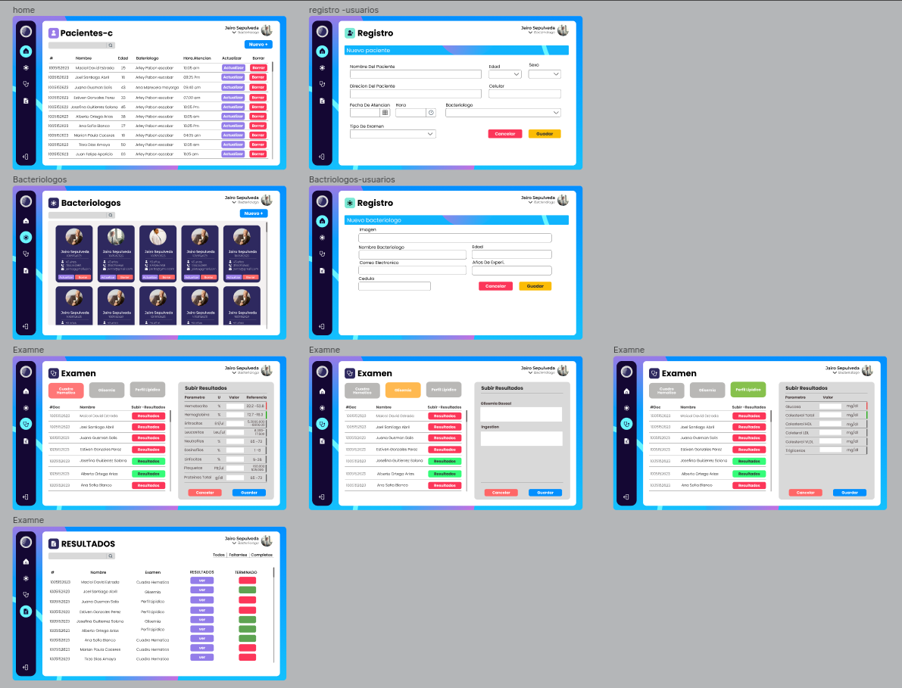
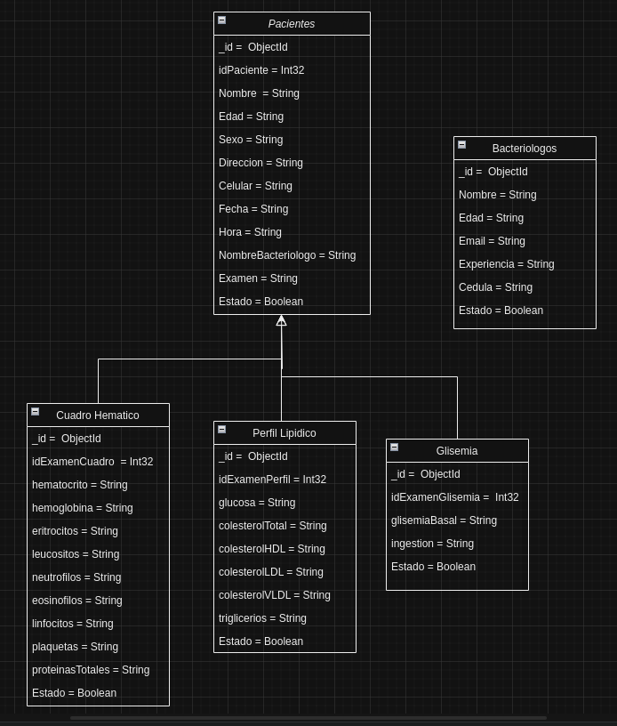

# PRE_FILTRO

## Autor: **Juan David Sepulveda Rojas** 

## Link del figma de el proyecto, del diagrama de la base de datos y la ruta del swagger

#### FIGMA

* https://www.figma.com/file/G83XxxeLJv6jWtZctBmYmq/Proyecto_3_dias?type=design&node-id=0%3A1&mode=design&t=AsmLy10OPfrfn4Pr-1

Lo va a llevar a esta pagina ☝️☝️

Eso es lo que va a mostrar 👇👇



#### DIAGRAMA DE LA DATABASE

* https://drive.google.com/file/d/1PqzcnPZgQ_uZ33nfjxfGB394Inmw6eTu/view?usp=sharing

Lo va a llevar a esta pagina ☝️☝️

Eso es lo que va a mostrar 👇👇



#### SWAGGER

1. Primero se tiene que instalar el node_modules

```bash
npm i
```

2. Segundo se tiene que ejecutar la api

```bash
npm run dev
```
Lo va a llevar a esta pagina 👇👇

```bash
http://localhost:5000/api-docs/#/
```


## Planteamiento del proyecto

Esta plataforma se ha diseñado para gestionar el registro de pacientes, bacteriólogos y sus respectivos exámenes de manera eficiente. Facilita la recopilación y el seguimiento de información relevante a través de métodos HTTP estándar, que incluyen:
* GET: Para obtener información.
* POST: Para agregar nuevos registros.
* DELETE: Para eliminar registros existentes.
* PUT: Para actualizar información existente.

En el contexto de pacientes y bacteriólogos, estos métodos se aplican de manera integral. Sin embargo, en el caso de los exámenes, la funcionalidad se limita a las operaciones GET y POST para garantizar una gestión eficiente de los datos clínicos."